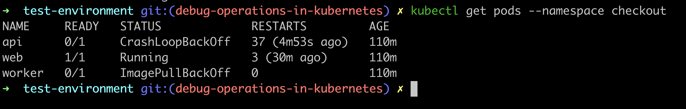
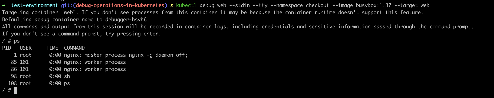
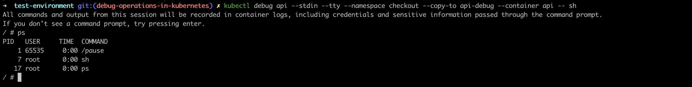

# Debug Operations in Kubernetes

The `kubectl` command-line tool communicates with your cluster through the Kubernetes Application Programming Interface (API). Each command on this page sends a request to the API server and prints the response.

This page describes `kubectl` commands that help you find the cause when a pod does not work as expected. Each command section contains the command syntax, an example with its output, and the common flags. For all flags, refer to the [kubectl reference](https://kubernetes.io/docs/reference/kubectl/generated/).

The examples use a test cluster with Kubernetes v1.37. The cluster has an example namespace named `checkout` with three pods: `web`, `api`, and `worker`. Your cluster has different names, ages, and timestamps. The examples come from different times, so the ages differ between examples. In each syntax line, replace the values in angle brackets, such as `<pod-name>`, with your own values.

## Command Summary

We recommend that you use the commands in the order of the following table. The first three commands only read information. The `kubectl exec` and `kubectl debug` commands can change active applications, so use them last.

| Command                                                 | Description                                        | Use Case                                             |
| ------------------------------------------------------- | -------------------------------------------------- | ---------------------------------------------------- |
| [`kubectl get pods`](#pod-status)                       | Lists pods and their status.                       | Find the pods that have a problem.                   |
| [`kubectl describe pod`](#pod-details-and-events)       | Prints the details and the recent events of a pod. | Find why a pod does not start.                       |
| [`kubectl logs`](#container-logs)                       | Prints the logs of a container.                    | Find why a container exits with an error.            |
| [`kubectl exec`](#commands-in-a-container)              | Executes a command inside an active container.     | Check files and settings from inside a container.    |
| [`kubectl debug`](#ephemeral-containers-and-pod-copies) | Creates a debug container or a copy of a pod.      | Debug a container when `kubectl exec` does not work. |

## Pod Status

The `kubectl get pods` command lists the pods in a namespace and the status of each pod. Use the following syntax.

```shell
kubectl get pods --namespace <namespace>
```

The following example lists the pods in the example namespace `checkout`.

```shell
kubectl get pods --namespace checkout
```

```text
NAME     READY   STATUS             RESTARTS         AGE
api      0/1     CrashLoopBackOff   37 (4m53s ago)   110m
web      1/1     Running            3 (30m ago)      110m
worker   0/1     ImagePullBackOff   0                110m
```



In this example, only the `web` pod works as expected. Its three restarts come from restarts of the test cluster, not from an error. The `api` container starts, exits with an error, and restarts repeatedly. The node cannot download the container image of the `worker` pod.

Without the `--namespace` flag, `kubectl` uses the `default` namespace, unless your configuration sets a different namespace. If the output is `No resources found in default namespace.`, the `default` namespace has no pods. Use the `--namespace` flag to select the namespace of your pods.

The following table lists common flags.

| Flag                      | Short Form       | Description                                                                                        |
| ------------------------- | ---------------- | -------------------------------------------------------------------------------------------------- |
| `--namespace <namespace>` | `-n <namespace>` | Selects one namespace. All commands on this page accept this flag.                                 |
| `--all-namespaces`        | `-A`             | Lists the pods of all namespaces.                                                                  |
| `--output wide`           | `-o wide`        | Adds more columns to the output, such as `IP` and `NODE`.                                          |
| `--watch`                 | `-w`             | Prints each status change as it happens. The command stays active until you stop it with `Ctrl+C`. |

### Status Values

The following table describes the most common values of the `STATUS` column and the command to use next.

| Status                             | Description                                                                                                                                        | Next Command           |
| ---------------------------------- | -------------------------------------------------------------------------------------------------------------------------------------------------- | ---------------------- |
| `Running`                          | The pod is active. If the application still fails, review the logs.                                                                                | `kubectl logs`         |
| `Pending`                          | Kubernetes cannot place the pod on a node yet. A common cause is that no node has enough free resources.                                           | `kubectl describe pod` |
| `ErrImagePull`, `ImagePullBackOff` | The node cannot download the container image. Common causes are a spelling error in the image name and missing credentials for the image registry. | `kubectl describe pod` |
| `CrashLoopBackOff`                 | The container starts, exits, and restarts repeatedly. Kubernetes waits longer before each restart.                                                 | `kubectl logs`         |
| `Error`                            | The container exits with an error code.                                                                                                            | `kubectl logs`         |
| `OOMKilled`                        | The container uses more memory than its limit allows, so the system stops the container.                                                           | `kubectl describe pod` |
| `Completed`                        | The container finishes its task without an error. This status is normal for jobs.                                                                  | `kubectl logs`         |

## Pod Details and Events

The `kubectl describe pod` command prints the details of a pod. The details include the state of each container and the recent events. Use this command when a pod does not start. A container that never starts has no logs, so the events are often the only source of information. Use the following syntax.

```shell
kubectl describe pod <pod-name> --namespace <namespace>
```

The following example describes the `worker` pod. The example output does not show all lines. Three dots (`...`) mark the missing lines.

```shell
kubectl describe pod worker --namespace checkout
```

```text
Name:             worker
Namespace:        checkout
...
Containers:
  worker:
    ...
    Image:          python:3.13-alpne
    ...
    State:          Waiting
      Reason:       ImagePullBackOff
    Ready:          False
    Restart Count:  0
...
Events:
  Type     Reason     Age                   From               Message
  ----     ------     ----                  ----               -------
  Normal   Scheduled  4m27s                 default-scheduler  Successfully assigned checkout/worker to pod-debug-control-plane
  Normal   Pulling    103s (x5 over 4m27s)  kubelet            spec.containers{worker}: Pulling image "python:3.13-alpne"
  Warning  Failed     103s (x5 over 4m27s)  kubelet            spec.containers{worker}: Failed to pull image "python:3.13-alpne": rpc error: code = NotFound desc = failed to pull and unpack image "docker.io/library/python:3.13-alpne": failed to resolve reference "docker.io/library/python:3.13-alpne": docker.io/library/python:3.13-alpne: not found
  Warning  Failed     103s (x5 over 4m27s)  kubelet            spec.containers{worker}: Error: ErrImagePull
  Warning  Failed     41s (x15 over 4m26s)  kubelet            spec.containers{worker}: Error: ImagePullBackOff
  Normal   BackOff    13s (x17 over 4m26s)  kubelet            spec.containers{worker}: Back-off pulling image "python:3.13-alpne"
```

In this example, the `Events` section reports that the image `python:3.13-alpne` does not exist. The image tag contains a spelling error. The correct tag is `3.13-alpine`.

Kubernetes keeps events for one hour by default, so use this command soon after a problem happens.

The following table lists a common flag.

| Flag                 | Short Form   | Description                                                                                                                                         |
| -------------------- | ------------ | --------------------------------------------------------------------------------------------------------------------------------------------------- |
| `--selector <label>` | `-l <label>` | Selects all pods with a matching label, such as `--selector app=worker`. Use this flag in place of the pod name. The command fails if you use both. |

## Container Logs

The `kubectl logs` command prints the logs of a container. Use this command when a container starts but exits with an error, or when the application does not work as expected. Use the following syntax.

```shell
kubectl logs <pod-name> --namespace <namespace>
```

The following example prints the logs of the `api` pod.

```shell
kubectl logs api --namespace checkout
```

```text
2026-09-21T02:00:57Z INFO Starting checkout-api v2.3.1
2026-09-21T02:00:57Z INFO Loading configuration from environment variables
2026-09-21T02:00:58Z ERROR Required environment variable DATABASE_URL is not set
2026-09-21T02:00:58Z FATAL Startup failed with exit code 1
```

In this example, the logs report that the application requires the `DATABASE_URL` environment variable. The pod definition does not set this variable.

If a container never starts, the container has no logs, and `kubectl logs` returns an error. In this case, use `kubectl describe pod` to find the reason.

The following table lists common flags.

| Flag                           | Short Form            | Description                                                                                                                        |
| ------------------------------ | --------------------- | ---------------------------------------------------------------------------------------------------------------------------------- |
| `--previous`                   | `-p`                  | Prints the logs of the previous container instance. Use this flag after a restart, when the current logs do not contain the error. |
| `--container <container-name>` | `-c <container-name>` | Selects one container of a pod that has more than one container.                                                                   |
| `--follow`                     | `-f`                  | Streams new log lines as they arrive. The command stays active until you stop it with `Ctrl+C`.                                    |
| `--tail <number>`              | None                  | Prints only the most recent lines, such as `--tail 50`.                                                                            |

## Commands in a Container

The `kubectl exec` command executes a command inside an active container. Use `kubectl exec` to check files, environment variables, and network connections from inside the container. Use the following syntax.

```shell
kubectl exec <pod-name> --namespace <namespace> -- <command>
```

The two dashes (`--`) separate the `kubectl` flags from the command that the container executes. Always include this separator, because the command fails without it.

> [!WARNING]
>
> The `kubectl exec` command acts on an active container. Avoid changes to files and processes in a production
> environment.

The following example prints the value of the `API_URL` environment variable in the `web` pod.

```shell
kubectl exec web --namespace checkout -- printenv API_URL
```

```text
http://api:8080
```

To open an interactive shell, add the `--stdin` and `--tty` flags, and use `sh` as the command. We recommend `sh` because many images do not contain `bash`. To end the session, enter `exit`. The following example opens a shell in the `web` pod and lists the `nginx` configuration files.

```shell
kubectl exec web --stdin --tty --namespace checkout -- sh
```

```text
# ls /etc/nginx/conf.d
default.conf
# exit
```

In this session, you enter `ls /etc/nginx/conf.d` and `exit` at the `#` prompt.

The following table lists common flags.

| Flag                           | Short Form            | Description                                                      |
| ------------------------------ | --------------------- | ---------------------------------------------------------------- |
| `--stdin`                      | `-i`                  | Sends your keyboard input to the container.                      |
| `--tty`                        | `-t`                  | Opens a terminal session. The two short forms combine to `-it`.  |
| `--container <container-name>` | `-c <container-name>` | Selects one container of a pod that has more than one container. |

The following table lists common error messages from `kubectl exec`. Each entry contains the part of the message that identifies the error.

| Error Message                                    | Cause                                                        | Solution                                                                                                               |
| ------------------------------------------------ | ------------------------------------------------------------ | ---------------------------------------------------------------------------------------------------------------------- |
| `container not found ("api")`                    | The container is not active.                                 | Use `kubectl logs` to find the cause. To check inside the container, use `kubectl debug` with a [pod copy](#pod-copy). |
| `exec: "sh": executable file not found in $PATH` | The image has no shell.                                      | Use `kubectl debug` with an [ephemeral container](#ephemeral-container).                                               |
| `cannot create resource "pods/exec"`             | Your account does not have permission to use `kubectl exec`. | Ask your cluster administrator for access.                                                                             |

## Ephemeral Containers and Pod Copies

Use the `kubectl debug` command when `kubectl exec` does not work. The command has two modes for pods and one mode for nodes. This page covers the two modes for pods. In both modes, the `--stdin` and `--tty` flags work as in `kubectl exec`. To learn more about the mode for nodes, refer to the [node debug guide](https://kubernetes.io/docs/tasks/debug/debug-cluster/kubectl-node-debug/).

| Mode                | Behavior                                                                                | Use Case                                                                                     |
| ------------------- | --------------------------------------------------------------------------------------- | -------------------------------------------------------------------------------------------- |
| Ephemeral container | Adds a temporary debug container to an active pod. The pod does not restart.            | The image of the container has no shell, or the image does not have the tools that you need. |
| Pod copy            | Creates a copy of a pod. In the copy, you can replace the start command of a container. | The container exits at startup, so `kubectl exec` has no active container to connect to.     |

> [!WARNING]
>
> Kubernetes records all input and output of a debug session in the container logs. Do not enter passwords, tokens, or
> other secrets in a debug session.

### Ephemeral Container

An ephemeral container is a temporary container that you add to an active pod. Use the following syntax.

```shell
kubectl debug <pod-name> --stdin --tty --namespace <namespace> --image <debug-image> --target <container-name>
```

The following example adds a `busybox` container to the `web` pod. The `busybox` image is a small image with common Linux tools, such as the `sh` shell and the `ps` command. The `ps` command lists processes. The `nginx` image of the `web` container does not include `ps`.

```shell
kubectl debug web --stdin --tty --namespace checkout --image busybox:1.37 --target web
```

```text
Targeting container "web". If you don't see processes from this container it may be because the container runtime doesn't support this feature.
Defaulting debug container name to debugger-hsvh6.
All commands and output from this session will be recorded in container logs, including credentials and sensitive information passed through the command prompt.
If you don't see a command prompt, try pressing enter.
/ # ps
PID   USER     TIME  COMMAND
    1 root      0:00 nginx: master process nginx -g daemon off;
   85 101       0:00 nginx: worker process
   86 101       0:00 nginx: worker process
   98 root      0:00 sh
  108 root      0:00 ps
/ # exit
Session ended, the ephemeral container will not be restarted but may be reattached using 'kubectl attach web -c debugger-hsvh6 -n checkout -i -t' if it is still running
```



In this session, you enter `ps` and `exit` at the `/ #` prompt. When you exit the shell, the debug container stops. You cannot remove an ephemeral container from the pod definition. The stopped container stays in the pod definition until you delete the pod.

The following table lists the flags of this mode.

| Flag                        | Short Form | Description                                                                                                                                                      |
| --------------------------- | ---------- | ---------------------------------------------------------------------------------------------------------------------------------------------------------------- |
| `--image <debug-image>`     | None       | Sets the image of the debug container.                                                                                                                           |
| `--target <container-name>` | None       | Gives the debug container access to the processes of the container that you specify. In the example, this flag lets the `ps` command list the `nginx` processes. |

### Pod Copy

A pod copy is a new pod that uses the definition of the original pod. By default, the copy does not keep the labels, annotations, or probes of the original pod. As a result, services do not send traffic to the copy. In the copy, you can replace the start command of a container, so the container stays active. Use the following syntax.

```shell
kubectl debug <pod-name> --stdin --tty --namespace <namespace> --copy-to <new-pod-name> --container <container-name> -- <command>
```

The following example creates a copy of the `api` pod and names the copy `api-debug`. In the copy, the `api` container starts a shell instead of the application.

```shell
kubectl debug api --stdin --tty --namespace checkout --copy-to api-debug --container api -- sh
```

```text
All commands and output from this session will be recorded in container logs, including credentials and sensitive information passed through the command prompt.
If you don't see a command prompt, try pressing enter.
/ # ps
PID   USER     TIME  COMMAND
    1 65535     0:00 /pause
    7 root      0:00 sh
   17 root      0:00 ps
/ # exit
Session ended, resume using 'kubectl attach api-debug -c api -n checkout -i -t' command
```



In this session, you enter `ps` and `exit` at the `/ #` prompt. The process list contains the `sh` shell in place of the application, so the container stays active. Most container runtimes start a `/pause` process in each pod. This process keeps the shared resources of the pod. The list contains this process because the containers of a pod copy share one process list by default.

The following table lists the flags of this mode.

| Flag                           | Short Form            | Description                                                                                          |
| ------------------------------ | --------------------- | ---------------------------------------------------------------------------------------------------- |
| `--copy-to <new-pod-name>`     | None                  | Creates a copy of the pod. The copy has the name that you specify. The original pod does not change. |
| `--container <container-name>` | `-c <container-name>` | Selects the container of the copy that receives the new start command.                               |

The `kubectl debug` command does not delete the copy. Delete the copy when you finish. The following example deletes the `api-debug` pod.

```shell
kubectl delete pod api-debug --namespace checkout
```

```text
pod "api-debug" deleted from checkout namespace
```

## Resources

To learn more about `kubectl` and Kubernetes, refer to the following pages of the Kubernetes documentation.

- [kubectl reference](https://kubernetes.io/docs/reference/kubectl/generated/)
- [Debug Running Pods](https://kubernetes.io/docs/tasks/debug/debug-application/debug-running-pod/)
- [Ephemeral Containers](https://kubernetes.io/docs/concepts/workloads/pods/ephemeral-containers/)
- [Pod Lifecycle](https://kubernetes.io/docs/concepts/workloads/pods/pod-lifecycle/)
- [Kubernetes Overview](https://kubernetes.io/docs/concepts/overview/)